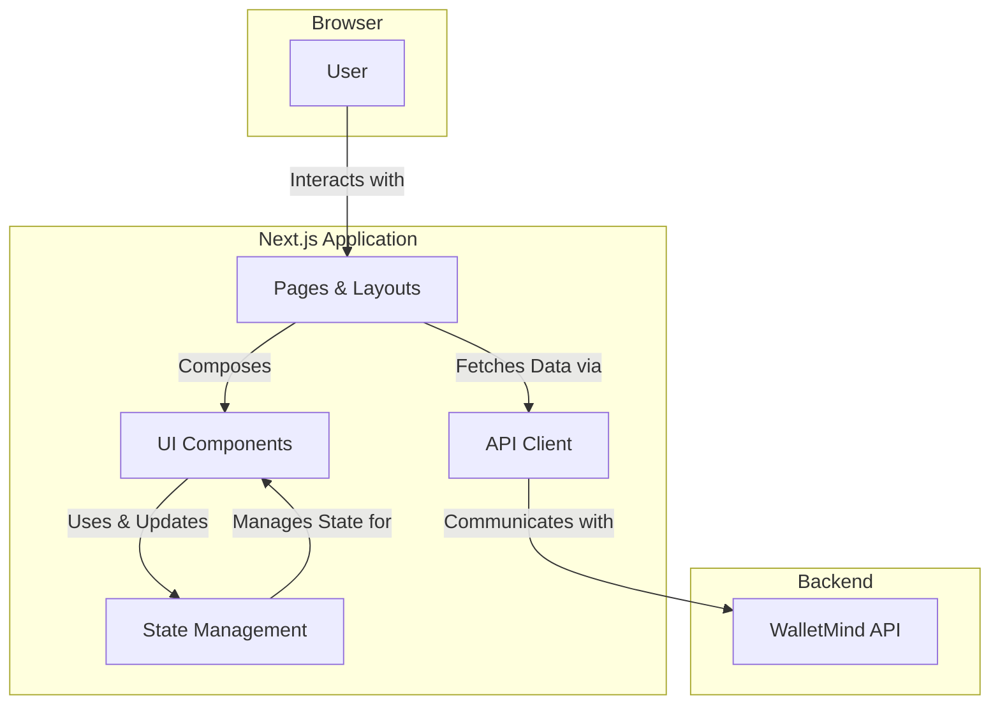

<div align="center">

# WalletMind Frontend

> A sleek, real-time dashboard for the WalletMind autonomous AI agent system, built with Next.js, TypeScript, and Tailwind CSS.

</div>

This frontend provides a world-class user interface for monitoring, managing, and interacting with the WalletMind multi-agent system. It features a dark mode theme with electric blue and warm gold accents, fluid animations, and a focus on polished micro-interactions.

---

## 🏗️ Architecture

The frontend is a modern Next.js application that follows a component-based architecture. It communicates with the WalletMind backend via a REST API and WebSockets for real-time updates.



| Component | Technology | Purpose |
|---|---|---|
| **Framework** | Next.js 14 (App Router) | Provides server-side rendering, routing, and a robust application structure. |
| **Language** | TypeScript | Ensures type safety and improves developer experience. |
| **Styling** | Tailwind CSS 3 | A utility-first CSS framework for rapid, custom UI development. |
| **Animations** | Framer Motion | Powers fluid animations and micro-interactions. |
| **Components** | Radix UI | Provides accessible, unstyled primitives for building high-quality components. |
| **Icons** | Lucide | A clean and consistent icon set. |
| **State Management**| Zustand | A small, fast, and scalable state management solution. |

---

## 🚀 Quick Start

### Prerequisites

- **Node.js**: 20.0 or higher
- **npm**: 10.0 or higher (or yarn/pnpm)

### Installation

1.  **Navigate to the frontend directory:**
    ```bash
    cd frontend
    ```

2.  **Install dependencies:**
    ```bash
    npm install
    ```

3.  **Set up environment variables:**
    -   Copy the `.env.example` file to `.env.local`.
    -   The default values are configured for local development and should work out-of-the-box if the backend is running on `http://localhost:8000`.
    ```bash
    cp .env.example .env.local
    ```

4.  **Run the development server:**
    ```bash
    npm run dev
    ```
    The application will be available at `http://localhost:3000`.

---

## ⚙️ Project Structure

```
frontend/
├── app/                  # Next.js App Router pages and layouts
├── components/           # Reusable React components
│   ├── layout/           # Global layout components (header, sidebar)
│   ├── pages/            # Components specific to a single page
│   ├── ui/               # Generic, reusable UI elements (Button, Card)
│   └── visual/           # Visual flair components (animations, backgrounds)
├── lib/                  # Core application logic
│   ├── hooks/            # Custom React hooks
│   ├── services/         # Business logic and API communication
│   ├── stores/           # Zustand state management stores
│   ├── api-client.ts     # Centralized API client
│   └── types.ts          # TypeScript type definitions
├── public/               # Static assets (images, fonts)
└── tailwind.config.ts    # Tailwind CSS configuration
```

---

## 🎨 Component Showcase

The frontend is built with a focus on a "perfect" UI layout, with no misalignments or overlaps. Key UI components in `components/ui/` include:

-   **AgentChat**: A chat interface for interacting with AI agents.
-   **ApprovalModal**: A modal for approving or rejecting agent decisions.
-   **Badge**: A component for displaying status indicators.
-   **Button**: A highly customizable button with multiple variants.
-   **Card**: A versatile card component for displaying content.
-   **ClarificationModal**: A modal for providing additional information to agents.
-   **Dialog**: A base component for creating dialogs and modals.
-   **ErrorNotification**: A toast-like notification for displaying errors.
-   **Textarea**: A multi-line text input field.

---

## 🧠 State Management with Zustand

Global state is managed using Zustand, a minimalistic state management library. Stores are located in `lib/stores/` and are organized by feature (e.g., `agentStore`, `walletStore`).

**Example: `agentStore`**
```typescript
import { create } from 'zustand';

interface AgentState {
  agents: Agent[];
  activeAgent: Agent | null;
  setActiveAgent: (agent: Agent) => void;
  // ... other state and actions
}

export const useAgentStore = create<AgentState>((set) => ({
  agents: [],
  activeAgent: null,
  setActiveAgent: (agent) => set({ activeAgent: agent }),
}));
```

---

## 🧪 Testing

The frontend uses Playwright for end-to-end testing to ensure a flawless user experience.

-   **Run all tests:**
    ```bash
    npx playwright test
    ```
-   **Install Playwright browsers (if needed):**
    ```bash
    npx playwright install
    ```

---

## 🤝 Contributing

Contributions are welcome! Please follow the project's main contributing guidelines.

1.  Create a feature branch.
2.  Make your changes.
3.  Ensure all tests pass.
4.  Submit a pull request.
